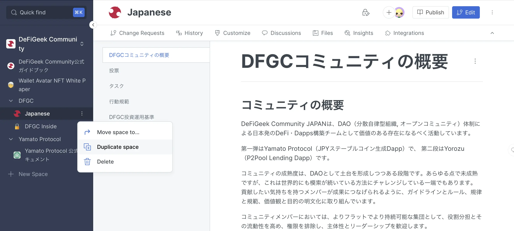
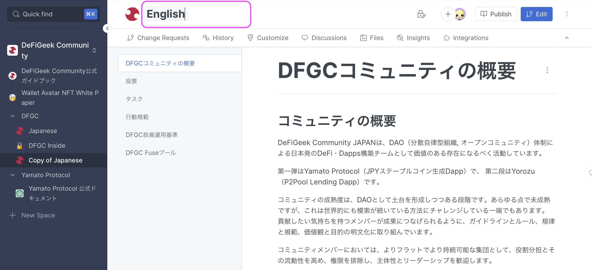
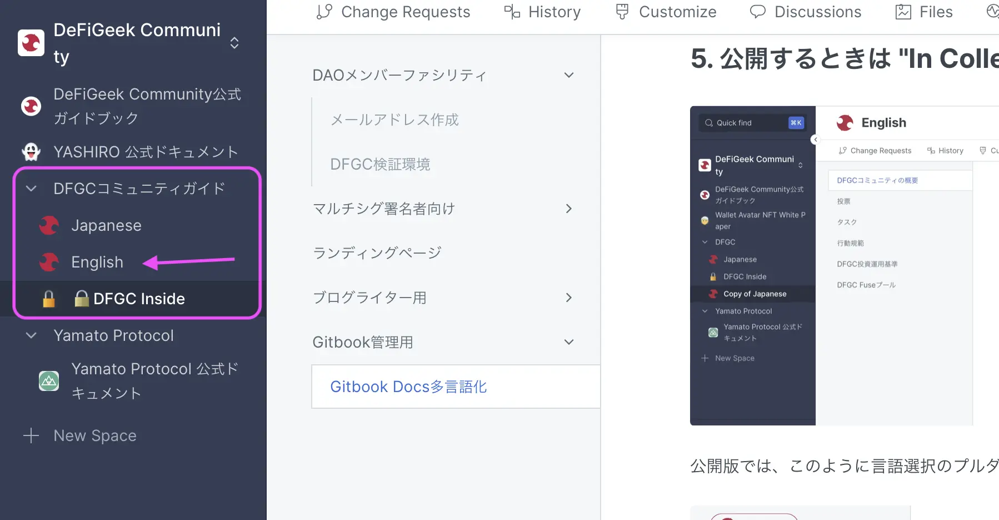
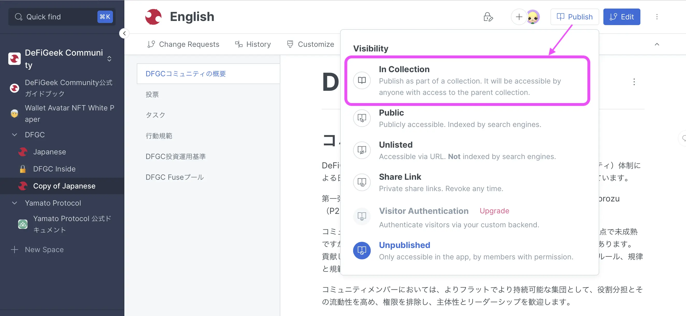
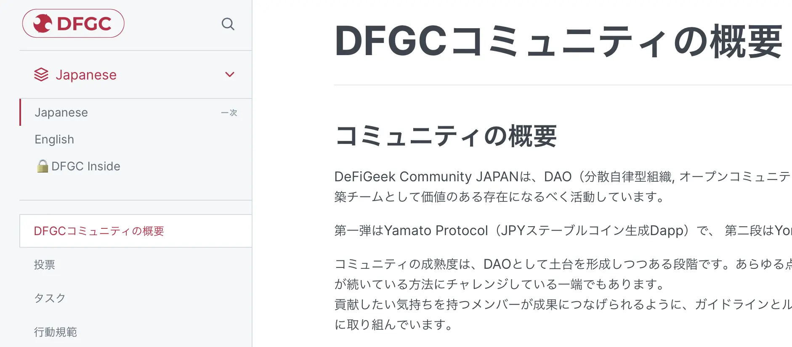
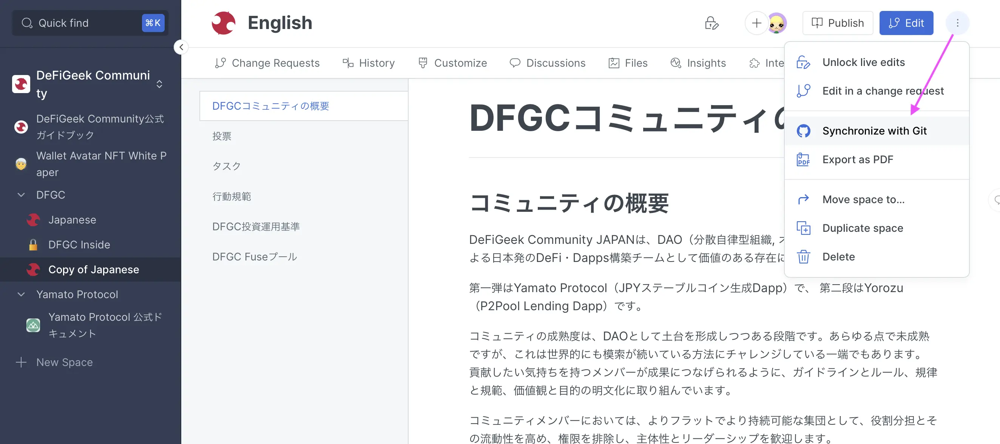

# Gitbook Docs多言語化

日本語版ができていて、その英語版やスペイン語版を作成したいときの手順。

## 多言語スペースを追加する

### 1. 多言語化したいスペースを複製

日本語版のスペースの右側「**:**」で **Duplicate space** をクリック。

<figure><figcaption></figcaption></figure>

### 2. スペース名を言語に変える

サイドバーで変えてもOK。ここで書いた名前がプルダウンに表示されます。

<figure><figcaption></figcaption></figure>

### 3. 翻訳作業を進める

1と2で作ったスペースで翻訳を進めます。

### ⚠️ 多言語版はコレクションの中に入れる

この枠がコレクション。この中に入れて次の 4. の公開方法をすることで、言語のプルダウンで表示されます。

<figure><figcaption></figcaption></figure>

### 4. 公開するときは "In Collection" でPublish

<figure><figcaption></figcaption></figure>

公開版では、このように言語選択のプルダウンが表示されるようになります。

<figure><figcaption></figcaption></figure>


公開後は Rename でファイル名をキレイなものに変更しましょう


## 公開後にドキュメントを編集する

編集するときは以下の通り。

* 右上の**Edit**ボタンを押す
* ドキュメントを編集する
* すべて編集完了したら下の**Submit**または**Merge**を押す
* 公開版に反映され、自動でGithubに同期される

## 初回のみGithub連携

1. Githubでmasterブランチを選択
2. monorepo project directoryに ./english と入力することでenglishディレクトリが作成され英語版が格納される 
3. GitbookからmasterブランチにSyncしenglishディレクトリにファイルを反映
4. 以後githubで内容を更新してもgitbookで内容を更新しても相互に同期されます

<figure><figcaption></figcaption></figure>

