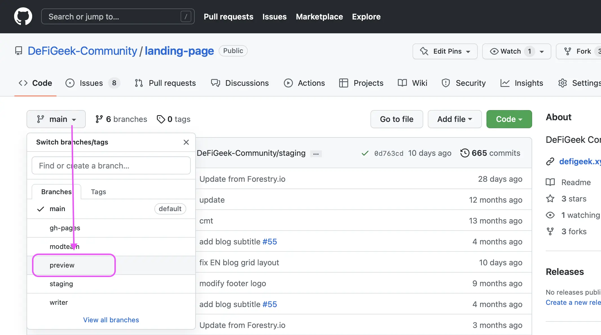
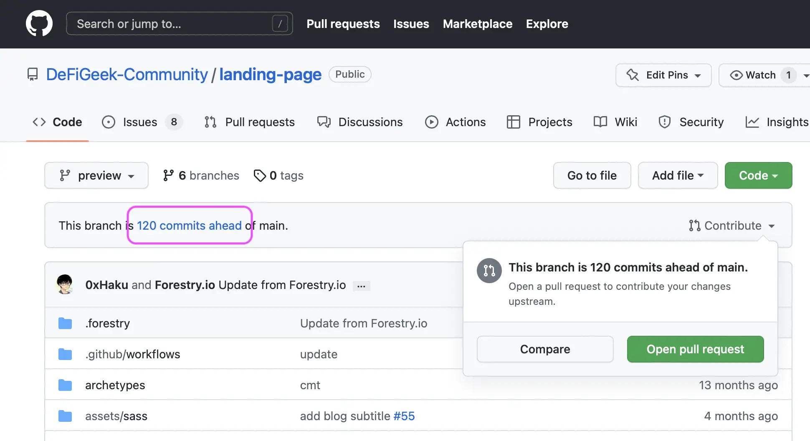
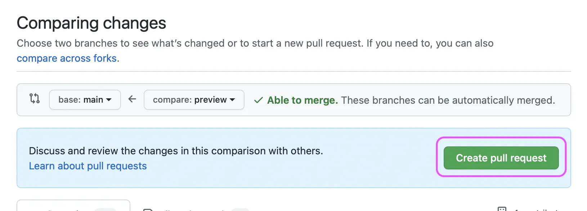

# マージ（公開）

tina等のブランチで記事が仕上がったら、mainブランチにマージして一般公開します。以下、ブログを公開する例です。

## ブログの公開

プレビュー用にGithub上の **tina** ブランチに格納されるものを公開する手順は **tina → main** のマージを行います。

#### 1. Github のlanding-pageリポジトリに行く



#### 2. ブランチを Tina に切り替える

<figure><figcaption></figcaption></figure>

#### 3. マージの前に確認

いきなりプルリクエストはせず、何が本番環境にマージされるのかを確認しましょう。

<figure><figcaption></figcaption></figure>

#### 4. プルリクエストする

コメントはほとんど必要ありません。

<figure><figcaption></figcaption></figure>

#### 5. マージする

レビュアーがマージします。権限がある人はセルフでマージしてください。

