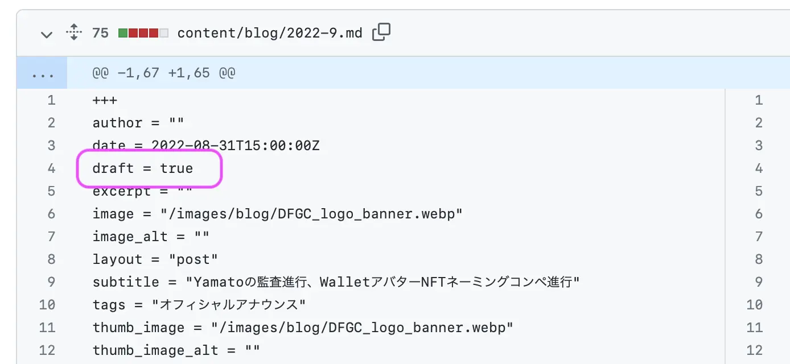

# マージ（公開）

previewやstaging等のブランチで記事が仕上がったら、mainブランチにマージして一般公開します。以下、ブログを公開する例です。

## ブログの公開

Forestryで書いたブログは、Github上の **preview** ブランチに格納されます。公開は **preview → main** のマージを行います。

#### 1. Github のlanding-pageリポジトリに行く



#### 2. ブランチを preview に切り替える

<figure><figcaption></figcaption></figure>

#### 3. マージの前に確認

いきなりプルリクエストはせず、何が本番環境にマージされるのかを確認しましょう。

<figure><figcaption></figcaption></figure>


Forestryで複数人でブログを書いてる＝ previewブランチには複数人の記事・下書きがあって、ごちゃまぜだからです。


自分の記事の内容が含まれているか、他の人の記事も混ざってるかをざっと見ます。

例えば、他の人がまだ仕上げていないとか、投票中、レビュー中で公開してはいけないものがあったら、記事が **draft = true** になっているかどうかを中身まで見ます。

<figure><figcaption></figcaption></figure>

#### 4. プルリクエストする

コメントはほとんど必要ありません。

<figure><figcaption></figcaption></figure>

#### 5. マージする

レビュアーがマージします。権限がある人はセルフでマージしてください。

