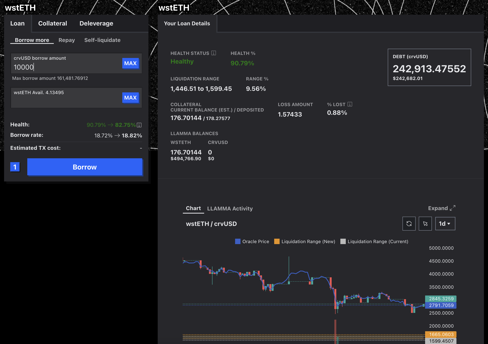

# Curve作業

## 月次担保解除TX作成方法

1\. Curve.fiを開きSafeウォレットを接続する。
  
URL：[https://crvusd.curve.fi/#/ethereum/markets/wsteth/manage/collateral](https://crvusd.curve.fi/#/ethereum/markets/wsteth/manage/collateral)

2\. CollateralのRemoveを選択後、必要額を入力しRemove Collateralを押下。
  
<figure><figcaption></figcaption></figure>

## 追加借入TX作成方法

1\. Curve.fiを開きSafeウォレットを接続する。
  
URL：[https://crvusd.curve.fi/#/ethereum/markets/wsteth/manage/loan](https://crvusd.curve.fi/#/ethereum/markets/wsteth/manage/loan)

2\. LoanのBorrow Moreを選択し、crvUSD borrow amountに必要額を入力後Borrowを押下。
  
<figure><figcaption></figcaption></figure>