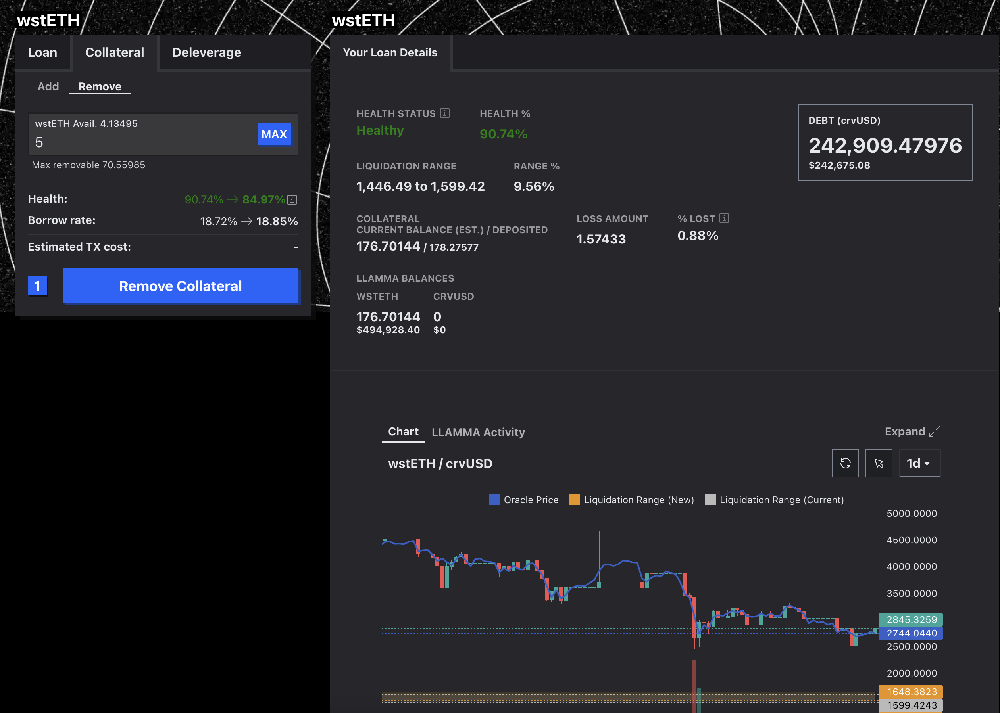

# 月次Curve作業

## 担保解除TX作成方法

1\. Votiumを開きSafeウォレットを接続する。
  
URL：[https://crvusd.curve.fi/#/ethereum/markets/wsteth/manage/collateral](https://crvusd.curve.fi/#/ethereum/markets/wsteth/manage/collateral)

2\. CollateralのRemoveを選択後、必要額を入力しRemove Collateralを押下。
  
<figure><figcaption></figcaption></figure>

  

