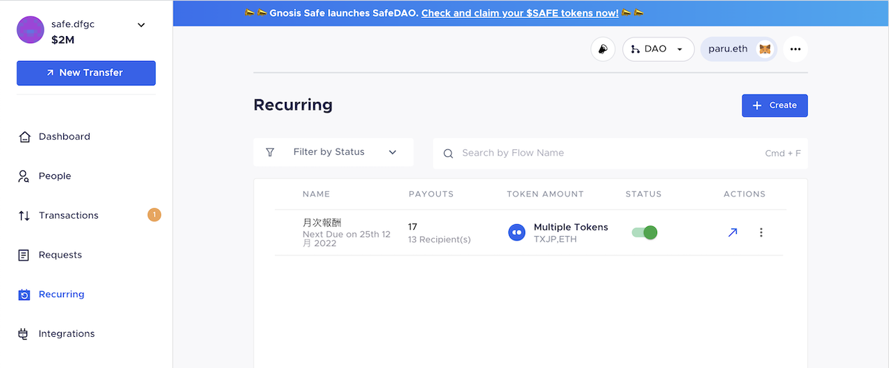
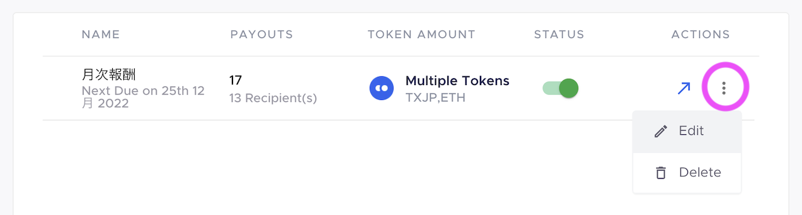
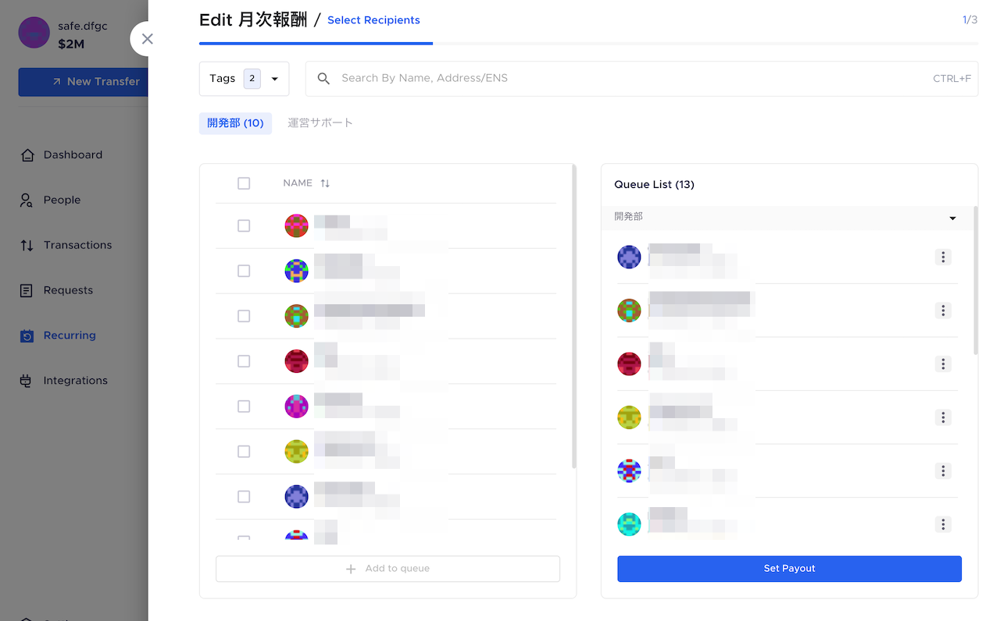
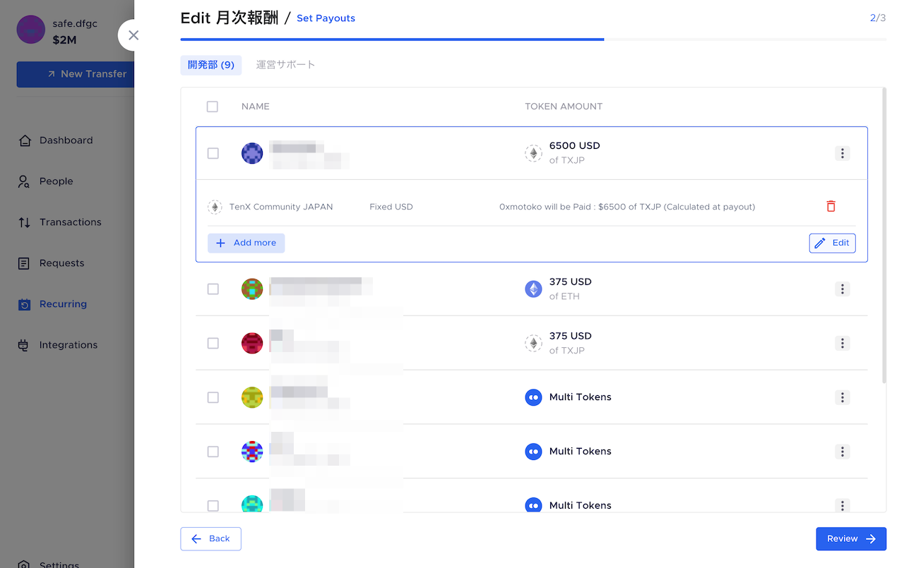
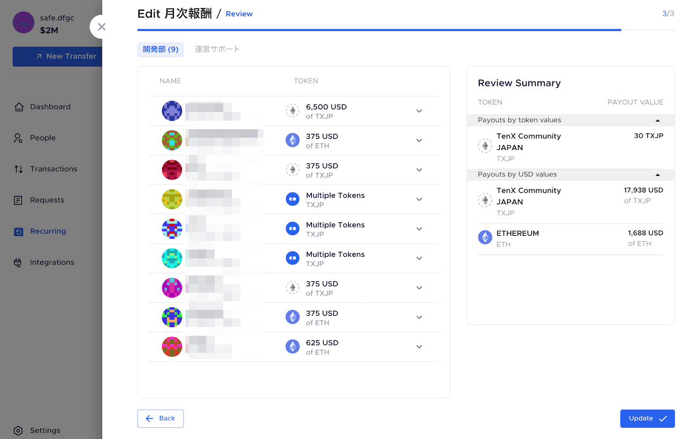
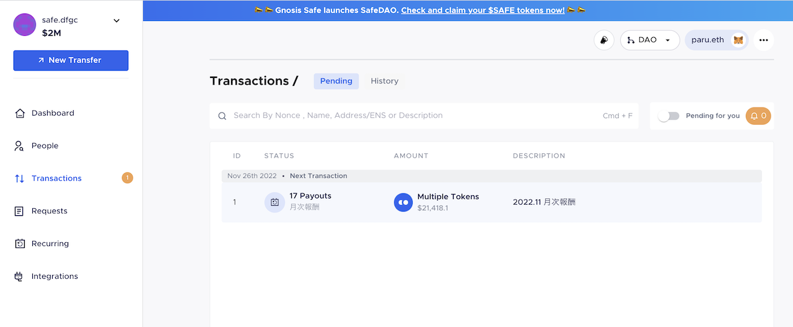
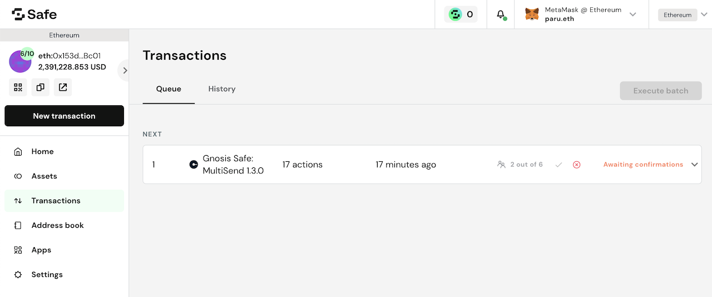
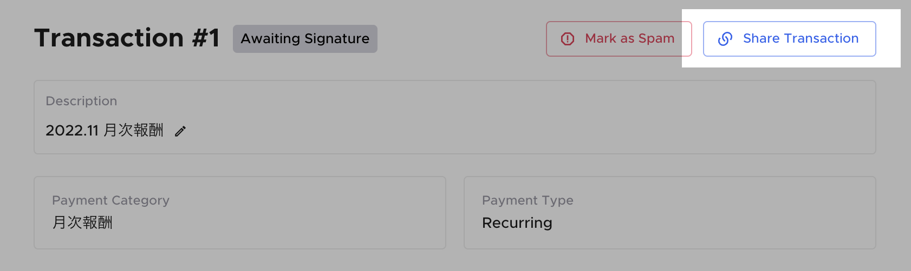

# Parcel - Safe管理ツール

## Parcelへの参加

Safeオーナーのみがアクセスできます。

1. [https://app.parcel.money/](https://app.parcel.money/) にアクセス
2. MetamaskはEthereumチェーンにして接続する
3. DAOを選んでSelect Safeをクリック
4. Metamaskで署名
5. 0x153d9D…Bc01 をImport

## スポット支払い

スポット報酬やリレイヤー支払いなど、単発の支払いはここでしましょう。

1. トップ画面の左上の**New Transfer**をクリック
2. 宛先のETHアドレス、トークン種別、金額を入力
   * 宛先が未登録のときは登録します。タグは該当するものがなければContributorを選んでください
3. **Add to queue**
4. Descriptionを記入（○○タスクのスポット報酬 など）
5. **Create Transaction**

## 定期的な支払い（Recurring）

ロール報酬、四半期報酬の支払いリストが登録されています。ロール保有者や報酬額の変更があれば編集をします。

サイドバーの**Recurring**で、定期的な支払いリストが表示されます。

<figure><figcaption></figcaption></figure>

### 定期支払いの事前レビューとメンテナンス

Recurring画面で**Edit**を押して、支払先と金額をレビューします。

<figure><figcaption></figcaption></figure>

#### 1画面目

支払先を追加したいときはAdd to queueします。 ⚠️それ以前に**People**画面でその人を追加する必要があります。

<figure><figcaption></figcaption></figure>

#### 2画面目

支払い金額、トークン種別を変更したい時はここでEditします。

<figure><figcaption></figcaption></figure>

3画面目

それらの変更を反映するため**Update**ボタンを押します。

<figure><figcaption></figcaption></figure>

### 定期支払いの実行

このいずれかで実行できます。カテゴリとDescriptionは適切なものを入力してください。

* **New Transfer**から**Due Payments**を選択して実行
* サイドバーRecurringを選択して右上 ↗︎ ボタンから実行

<figure><figcaption>
実行するとTransactions画面にQueueが表示されます。
</figcaption></figure>

<figure><figcaption>
Safeの方にもQueueが表示され、Safeオーナーには署名依頼の通知が飛びます。
</figcaption></figure>

### Discordへの連絡も忘れずに

支払いを実行したらDiscordのマルチシグ管理部屋に報告しましょう。下記の**Share Transaction**でリンクコピーしたURLも添えてください。

<figure><figcaption></figcaption></figure>

