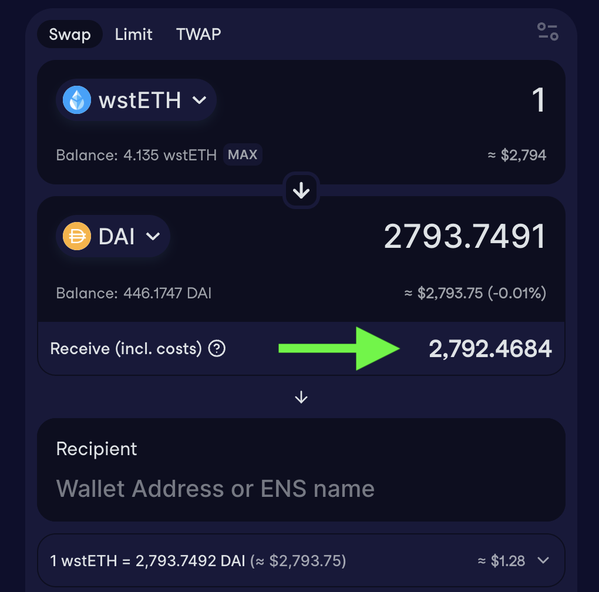
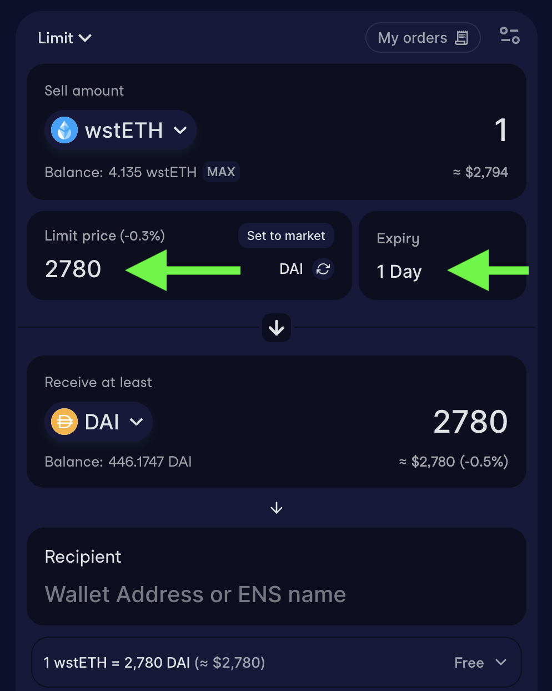
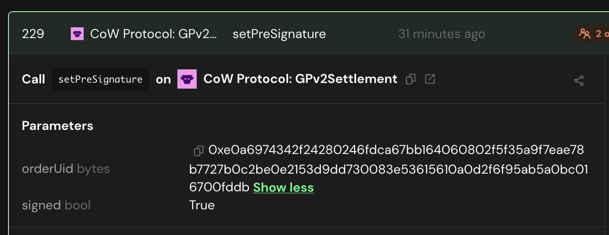
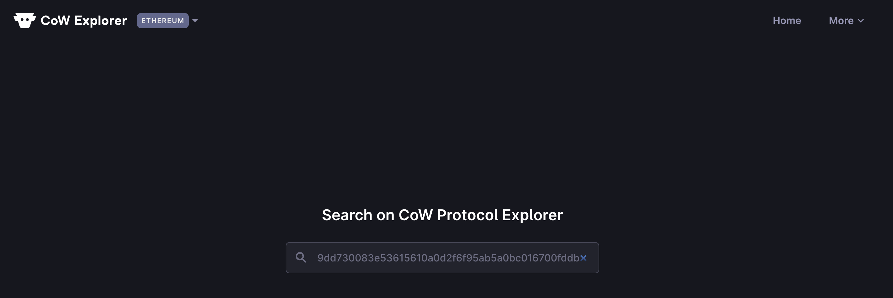
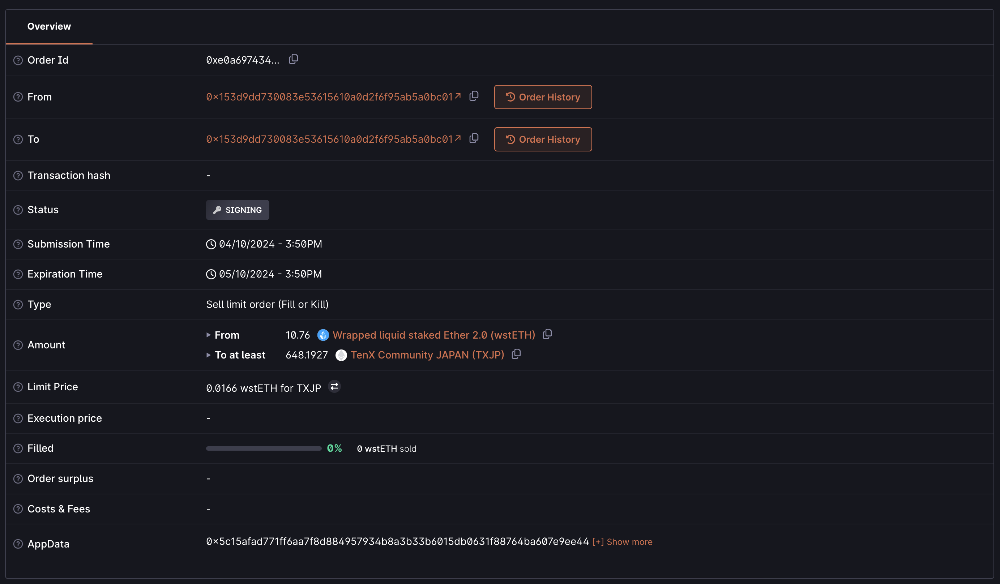

# Swap作業

## SwapTX作成方法

1\. CowSwapを開きSafeウォレットを接続する。注:Safe UIにあるCowswapを利用するとUI feeが別途発生するため以下URLを利用する。
  
URL：[https://swap.cow.fi/](https://swap.cow.fi/)

2\. 現在のレートを確認するためSwapを選択しreceive (incl. costs)を取得（以下1wstethを交換する例）、ただしここでTXは作成しない。
  
<figure><figcaption></figcaption></figure>

3\. Limitを選択し、指値注文を作成する。Sell Token, Sell amountを入力後、Expireを1日に変更、Limit Priceを操作しReceive at leastが先の2で取得したReceive(incl. costs)未満になるように調整する。（この例ではswap画面で出た2792.46未満になるようにLimitPriceを2780に変更）

ある程度幅を持たせると即時実行される(ガス代・市場レートの変動分)ので最大約1%程度下のレートを入力すると良い（市場より下にlimitを入れてもcowのバッチオークションで最適レートで実行されるため）
  
<figure><figcaption></figcaption></figure>

## マルチシグサイナーのTX確認方法

SafeのTXキューにはorderUidのみしか情報がない為、cowexplorerを使って別途内容が正しいか検証する必要がある。

1\. orderUidをクリップボードにコピー

<figure><figcaption></figcaption></figure>

2\. [https://explorer.cow.fi/](https://explorer.cow.fi/) を開き、先ほどのorderUidを検索ボックスにペーストしEnterを押下。

<figure><figcaption></figcaption></figure>

3\. スワップの内容を確認。確認ポイントはTo(受け取りアドレスが自身のものになっているか)、Type(Fill or Killになっているか)、ExpirationDate(時限が適切か)、AmountとExchange Rate(量が合っているか)。

<figure><figcaption></figcaption></figure>