# 月次活動報告・報酬計算ツール

## 月次報酬承認方法

1\. オーナー権限のあるdefigeek1@gmail.comでログインし報酬管理シートを開く\
\
報酬管理シートURL：[https://docs.google.com/spreadsheets/d/1fjsxEho3VlJldd8PpY3nQOkFTLaPbfxTtSnESOmD95I/](https://docs.google.com/spreadsheets/d/1fjsxEho3VlJldd8PpY3nQOkFTLaPbfxTtSnESOmD95I/)

2\. Open中は右上にプログレスバーが表示されるため消えるまで待つ

<figure><figcaption></figcaption></figure>

３.「一覧」タブを開き、A1のセルで報告月を選択（8月支払い予定の7月分活動報酬なら「７」を選択）

<figure>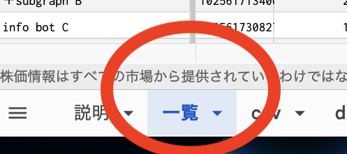<figcaption></figcaption></figure>

<figure>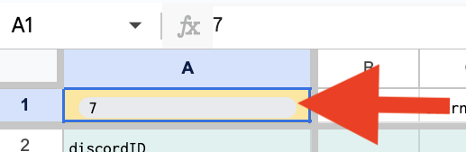<figcaption></figcaption></figure>

4\. １行目のユーザー名から１０行目のタイトルまでをスクリーンショットを撮りDiscordの月次報酬会議へ数値の問題がないか確認の投稿をする。

月次報酬会議 URL: [https://discord.com/channels/705052448418693180/1117063855642787850](https://discord.com/channels/705052448418693180/1117063855642787850)

<figure>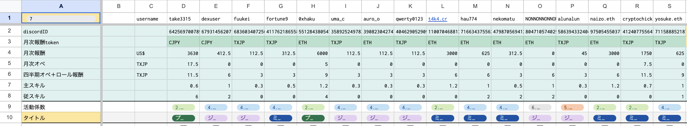<figcaption></figcaption></figure>

５. 問題がなければ同スクリーンショットとシートのURLを記載し月次報酬の合意としてsnapshot投票を投稿

⚠️投票期間は第3日曜日～次週木曜午後6時に設定

スナップショット投票サンプル：[https://snapshot.org/#/defigeek.eth/proposal/0xcb5ec472af2691af6a719f0ae121c5baa1e2b8bcdae991e825e99721022668b4](https://snapshot.org/#/defigeek.eth/proposal/0xcb5ec472af2691af6a719f0ae121c5baa1e2b8bcdae991e825e99721022668b4)

##

## 報酬トークン送信作成方法

1. 月次報酬承認方法の１〜３同様にシートを開く　

　⚠️プログレスバーは直近のトークン価格を取得している段階のため、必ず待つこと。

2. CSVタブを開き、ファイル→ダウンロード→カンマ区切り形式(csv)を選択し、CSV形式でダウンロードする

<figure>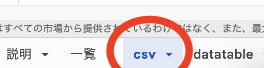<figcaption></figcaption></figure>

<figure>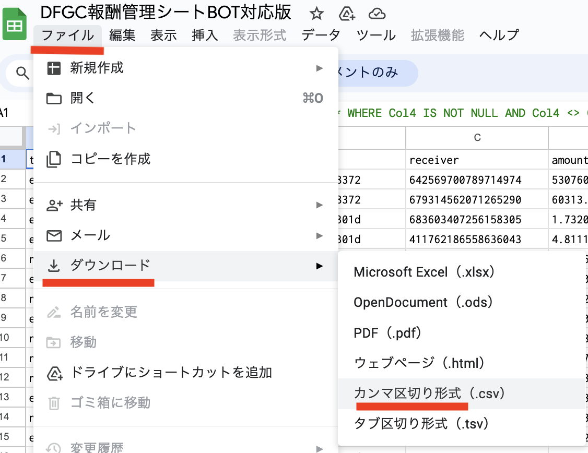<figcaption></figcaption></figure>

3. Yabumiにアクセスし、safe.defigeek.ethで接続（Safeウォレットコネクトアプリ利用）、一括送信を選択。ページ下部にCSVファイル選択が出てくるので、先ほどダウンロードしたCSVを指定。

Yabumi URL：[https://www.yabumi.xyz/](https://www.yabumi.xyz/)\

<figure>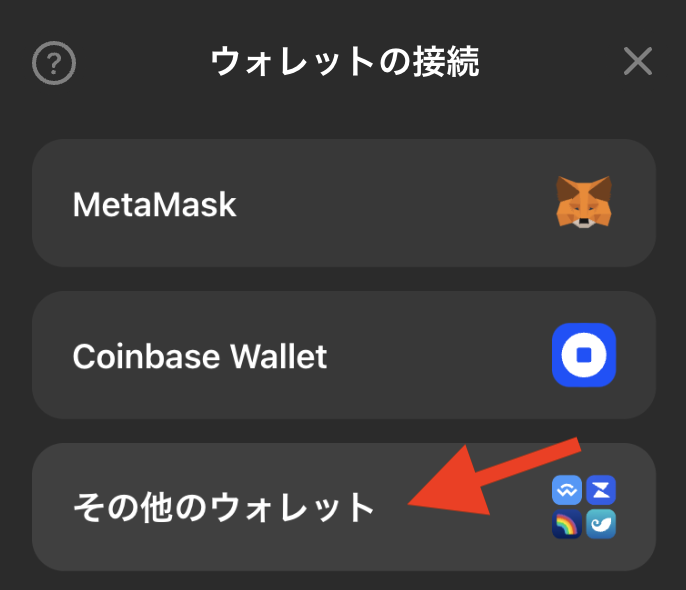<figcaption>
Yabumiでウォレットの接続、その他のウォレットを選択
</figcaption></figure>

<figure><figcaption>
ウォレットコネクトの接続情報をコピー
</figcaption></figure>

<figure>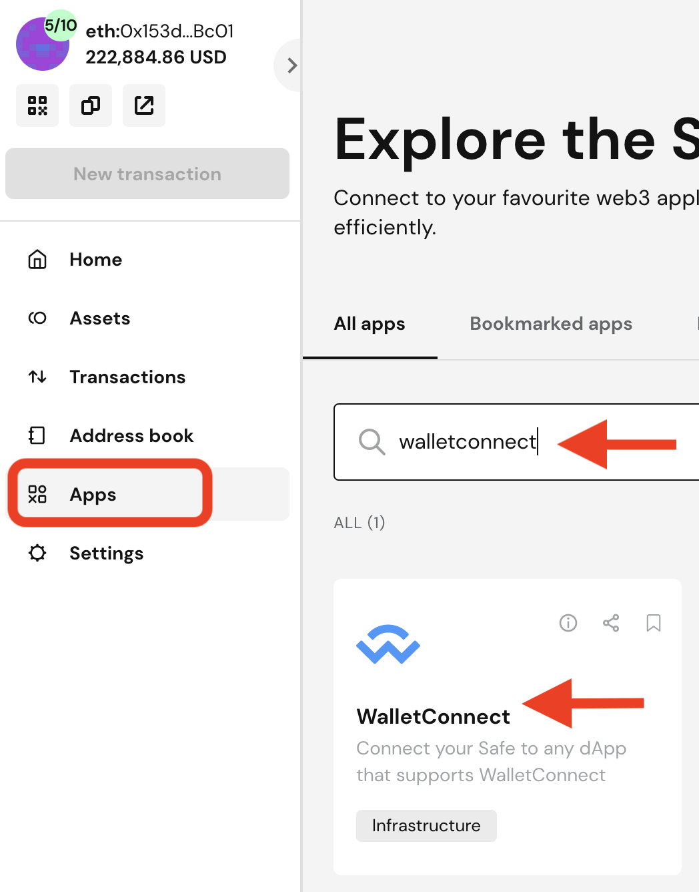<figcaption>
Safeを開き、appからwalletconnectを検索し開く
</figcaption></figure>

<figure>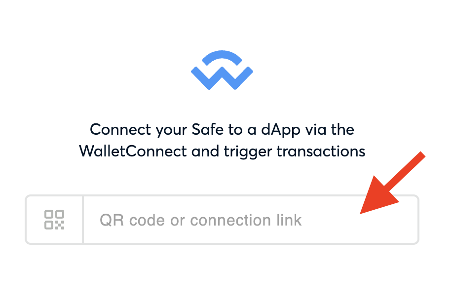<figcaption>
先ほどコピーした接続情報をペースト
</figcaption></figure>

<figure>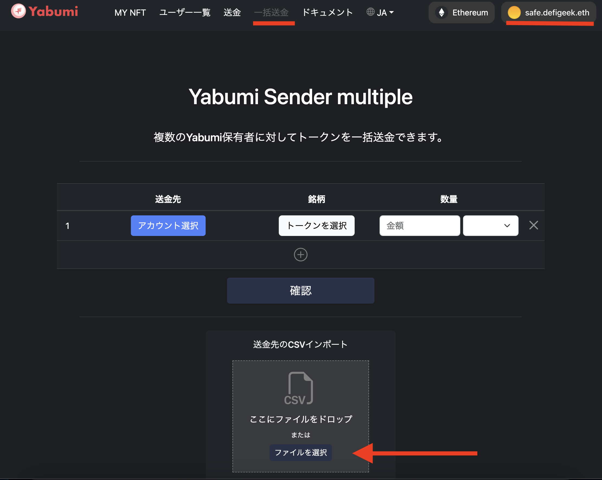<figcaption></figcaption></figure>

４. ファイル選択後（もしくはドロップ後）に送信ボタンが出てくるので押下

<figure>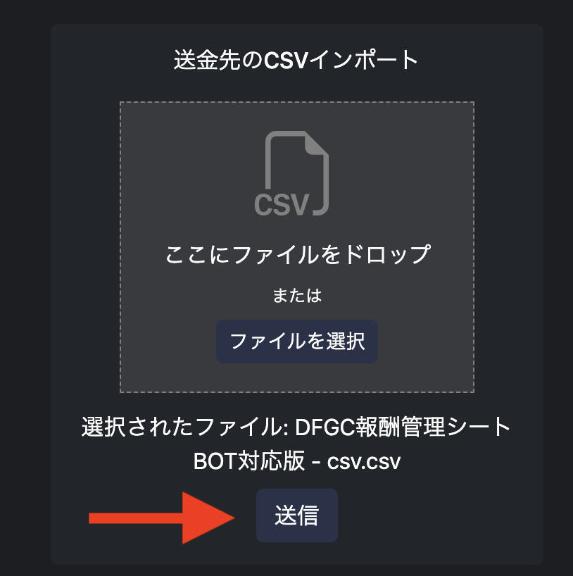<figcaption></figcaption></figure>

５. Yabumiの送信先、トークン、数量の一覧が出てくるため、内容を確認する。

⚠️確認ボタンを押下する前にPermit2の有効期限を設定すること。署名が揃うまでの猶予として12時間程度設定するのが望ましい。

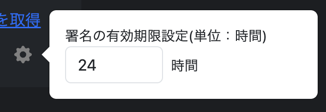

6. 最後に一括送信確認画面となるので、limit承認が必要な新トークンがある場合は各トークンの承認TX終了後に「送信」を押下、ない場合はそのまま最下部の「送信」を押下しPermit２署名・その後**再度「送信」を押下**し送信TXを作成する。\
   ⚠️SafeでのTXは最大合計3件：
   1. トークンの承認TX(一度承認すれば次回以降不要)
   2. Permit2の署名（有効期限以内であれば不要）
   3. トークン送信のTX署名（Permit2の有効期限以内に要実行）

<figure><figcaption></figcaption></figure>

<figure>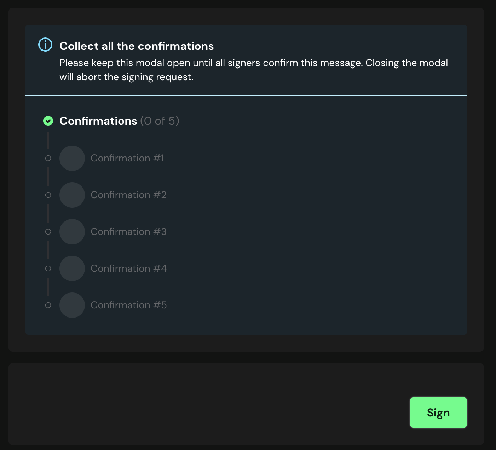<figcaption>
承認中はこの画面を閉じないこと。必要署名が集まればこの画面は消える
</figcaption></figure>

<figure>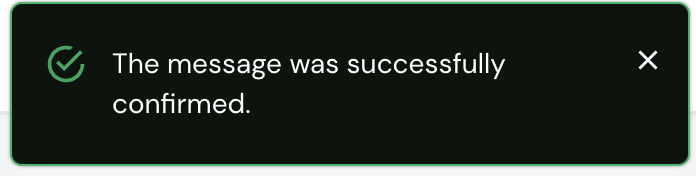<figcaption>
Permit2の署名が集まった場合、先ほどの画面の右上にこのメッセージが出ている
</figcaption></figure>

## 各種報酬パラメーター変更方法

各種パラメーターは報酬管理シートのdatatableで以下の通り設定変更可能です。

⚠️支払い通貨追加やロール追加の場合は財務部までご連絡ください

報酬管理シートURL：[https://docs.google.com/spreadsheets/d/1fjsxEho3VlJldd8PpY3nQOkFTLaPbfxTtSnESOmD95I/](https://docs.google.com/spreadsheets/d/1fjsxEho3VlJldd8PpY3nQOkFTLaPbfxTtSnESOmD95I/)

* 支払い通貨別ボーナス：　コラムGの倍数を変更(通常は1)
* 主スキルの係数：　コラムIの数値を変更
* 従スキルの係数：　コラムKのポイントを変更
* タイトル別ドル報酬：　コラムNのドル報酬を変更($)
* 活動係数：　コラムOの係数を変更
* 従スキル割増率；　コラムSの割増率を変更(%)
* 月次オペ報酬：　コラムUの報酬を変更(TXJP)
* 四半期オペ報酬：　コラムWの報酬を変更(TXJP)

.png>)

<figure>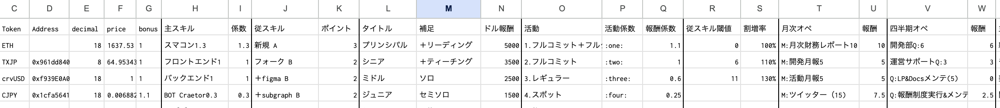<figcaption></figcaption></figure>

## 利用プラットフォーム

1️⃣ Discord Slash Command [https://github.com/take3315/discord-slash-command-dfgc](https://github.com/take3315/discord-slash-command-dfgc)\
・スラッシュコマンド/reportと/tokenchangeの発動・選択ウィンドウ・データ送信\
\
2️⃣ Google App Script [https://script.google.com/home/projects/1Z6Mp\_ZsPBdB7h6GgIw1C5Gr1YUrvCIifVxtoudAPRChtKJUwvt6TJYuC/edit](https://script.google.com/home/projects/1Z6Mp\_ZsPBdB7h6GgIw1C5Gr1YUrvCIifVxtoudAPRChtKJUwvt6TJYuC/edit)\
・1️⃣から送信されてきたデータをGoogle Sheetsへ保存\
\
3️⃣ Activity report data [https://docs.google.com/spreadsheets/d/19dG\_lpXsCCAEFgEY1mQWxSS5LJJtf5\_ofZ5jYSklxKg/](https://docs.google.com/spreadsheets/d/19dG\_lpXsCCAEFgEY1mQWxSS5LJJtf5\_ofZ5jYSklxKg/)\
・活動係数報告一覧\
\
4️⃣ Token report data [https://docs.google.com/spreadsheets/d/1yeeA31Em5gOCRIoaZ4gAEU1jaktLf4q-kV-qZ\_z5mes/](https://docs.google.com/spreadsheets/d/1yeeA31Em5gOCRIoaZ4gAEU1jaktLf4q-kV-qZ\_z5mes/)\
・トークン変更報告一覧\
\
5️⃣ 報酬管理シート [https://docs.google.com/spreadsheets/d/1fjsxEho3VlJldd8PpY3nQOkFTLaPbfxTtSnESOmD95I/](https://docs.google.com/spreadsheets/d/1fjsxEho3VlJldd8PpY3nQOkFTLaPbfxTtSnESOmD95I/)\
・計算用ファイル。参照先3️⃣及び4️⃣
