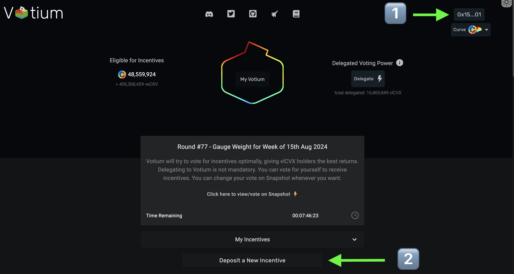

# 月次Votium作業

## Votium リワード投入TX作成方法

1\. Votiumを開きSafeウォレットを接続する。
  
Votium URL：[https://votium.app/](https://votium.app/)

2\. Deposit a new incentiveを選択する。
  
<figure><figcaption></figcaption></figure>

３\. 投入ラウンドを選択（通常月次で２ラウンド分投入する）。
  
4\. 報酬トークンでTXJPを選択。
  
5\. Bribe設定用プールを選択、プルダウンを選択しCJPYを入力することでWETH+CJPYプールが選択可能。選択後１ラウンド分のreward(現状は25TXJP)を入力。
  
6\. Add Another Poolを選択し５番同様にcrvUSD+CJPYプールを選択後Rewardを入力。
  
7\. Total Rewardsと１ラウンドのリワードが正しい事を確認後、Deposit Incentiveを押下しトランザクションを送信。
  
<figure><figcaption></figcaption></figure>
