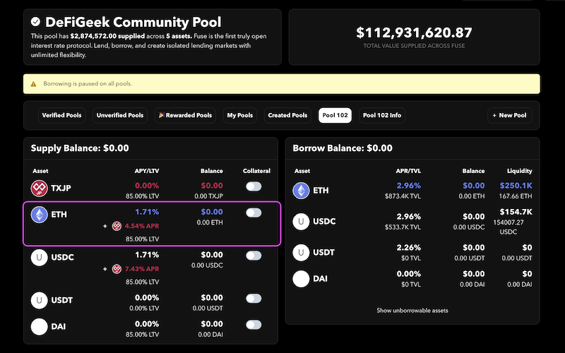
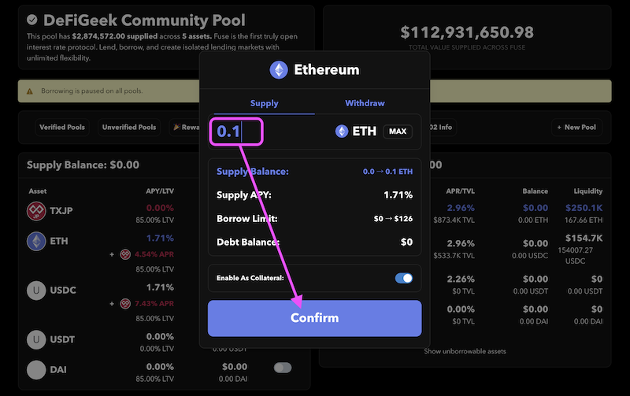
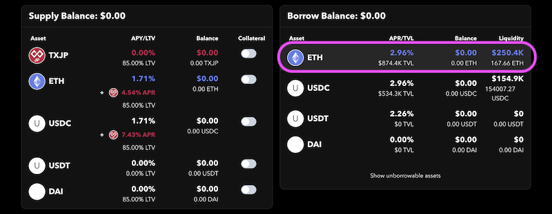
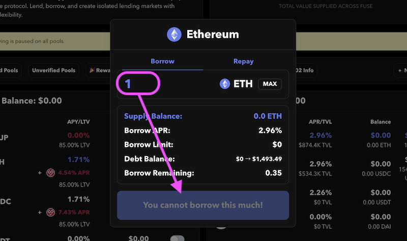

# DFGC Fuseプール

DFGC Fuseプールでは、自分が持っているトークンをプールに**貸し出す**ことと、貸出をした後に限度額まで別のトークンを**借りる**ことができます。

⚠貸出にも借入にも必ずリスクがあります。最後の注意事項まで理解した上でご利用ください。

### DFGC Fuseプールにアクセスする

PCのウェブブラウザまたはスマートフォンのウォレットアプリのWeb3ブラウザで、[DeFiGeek Community Pool #102](https://app.rari.capital/fuse/pool/102) ​にアクセスします。



## 貸し出す

画面左のSupplyとあるエリアが貸し出す場所です。貸し出したいトークンをクリックします。

<figure><figcaption></figcaption></figure>

貸し出す数量を入力して**Confirm**をクリックします。ウォレットが起動するため、トランザクションを承認します。

<figure><figcaption></figcaption></figure>


上記の貸出画面で、**Enable As Collateral**（担保として利用する）が初期状態でになっています。**Borrow Lim**表示される金額相当まで他のトークンを借りることができます。


### 引き出す場合は

貸し出したトークンを引き出したい時は、トークンを選択し、**Withdraw**のタブに切り替えて、引き出したい数量を入力して、**Confirm**をクリックします。

## 借りる

画面右のBorrowとあるエリアが借りる場所です。借りたいトークンをクリックします。

<figure><figcaption></figcaption></figure>

借りる数量を入力して**Confirm**をクリックします。ウォレットが起動するため、トランザクションを承認します。

<figure><figcaption></figcaption></figure>


画面の右端にある**Liquidity**は、アセットごとの貸出可能な総額が表示されています。この金額を超えて借入をすることはできません。


### 返済する場合は

借りたトークンを返済したい時は、トークンを選択し、Repayのタブに切り替えて、返済する数量を入力して、Confirmをクリックします。

## リワードを請求する

画面右上の自身のウォレットアドレス部分をクリック後、**Claim Rewards**を押下することでリワードを請求できます。一部トークンの貸し出しにはインセンティブが設定されており、該当ユーザーへ毎ブロックごとにリワードが発生します。

<figure><figcaption></figcaption></figure>

## 💵 金利について

プールへの貸出、借入には金利が発生します。プールへ貸出をした人は、貸し出した金額と金利を受け取ることができます。プールから借入をした人は、借りた金額と金利を支払う必要があります。

Supply側、Borrow側のそれぞれにある**APY/LTV**は、1年あたりの利率を表しています。

金利はリアルタイムに計算され、Supply Blance、Borrow Balanceに表示されます。

## （参考）ページの用語説明

* **APY/LTV**（Supply側）： APYは貸出金利の年利（複利計算）、LTV（Loan to Value）はCollateral Factorや担保率と同じ意味で、トークンの時価評価に対して何％を担保として認めるかの割合を指す。（例えば1万ドルの預け入れ資産に対し、LTVが80％である場合、最大8000ドル分のトークンを借り入れる事ができます）
* **APY/TVL**（Borrow側）： APYは借入金利の年利（複利計算）、TVL（Total Value Locked）は貸出総額を指す
* **Balance**： 貸出中、借入中の時価評価とトークン数を表示する
* **Collateral**： トークン毎に担保として利用するかどうかを選択できます。複数のトークンをCollateralとして許可すると許可した担保対象のトークン総額が清算の判定材料となります。LTVが0％のもの（USDT）をCollateralとする意味はありません。
* **Liquidity**： 現在のプール全体での最大借入可能額（Deposit - Borrow）です。

## ⚠️ 注意事項（清算リスク）

<mark style="color:red;">借入を行う場合、貸し出したトークンが清算されるリスクがあります。</mark>

借り入れ評価額（Borrow Balance）が担保評価額を割り込んだ場合、担保に入れている30％分が市場評価額より10%安い金額で清算され、清算された分の借り入れが解消されます。

> 例えば、$10,000を担保として貸し出し、2 ETH借り入れを行うとき、ETHが$4100に値上がりすると担保率80％を割り込むことになります。
>
> この時、貸出金額$10,000の30%である$3,000の担保が$2,700の評価額として清算され、0.658 ETH（≒$2,700相当）分の借り入れが解消されます。清算後は $7,000の担保と1.342ETHの借り入れが残ります。
>
> この時の担保評価額は$5,600で、借り入れ評価額は$5,502となっていて、ETHが更に上昇して$4,173を超えると再度担保割れを起こし清算が発生してしまいます。

## ⚠️ 注意事項（プール運営方針）

現状以下の方針に従ってプールの運営をしています。方針は都度変更になる場合がありますので利用時には[Discord](http://discord.gg/FQYXqVBEnh)にて最新情報を確認ください。

１、四半期毎に80%借入キャップ調整（不足流動性をコミュニティトレジャリーから注入また過剰がある場合は引出又はキャップの引き上げを検討←コミュニティ投票で実施を決定）&#x20;

２、Poolのコミュニティトレジャリー比率に相関したTXJPリワードブースト　（コミュニティファンドよりの流動性供給時にユーザー分TXJPリワード利回りが実質的に低下するので、コミュニティファンド比率分はTXJPリワードを増やして均衡させる。例えば総流動性の20％がコミュファン資金なら、四半期300×120％といった具合。（Pool毎に。））&#x20;

３、当初借入キャップは80％分に設定　（ETH及びUSDCの借入可能上限額は固定値）

📧 DFGC Fuseプールの使い方や注意点について不明点があるときは、[Discord](http://discord.gg/FQYXqVBEnh)でコミュニティメンバーに質問・相談しましょう。
