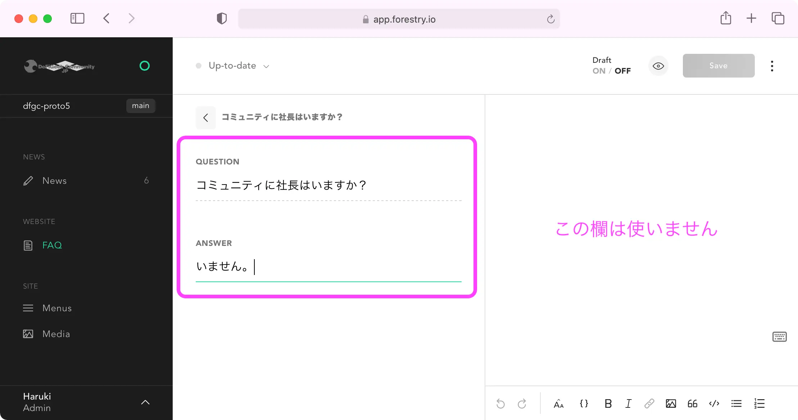

# FAQ追加手順

[Forestry](https://app.forestry.io/login)でアカウント登録して、ログインします。

### 1. FAQのページを開く

サイドバーのFAQを選択します。

Sectionsの中にある「FAQ」を選択します。

### 2. 新規FAQ追加

「ADD FAQ ITEM」をクリックします。

※ 既存の項目を編集するときは、その項目をクリックする。

### 3. FAQの入力

FAQの質問、回答とも、このヘッダー欄に記入します。枠が小さいので別アプリで作成してコピペするのをお勧めします。

右側のスペースには何も記載しないでください。

### 💡 プレビュー

保存したあと30秒ほどすると、プレビューサイトで自分が書いた記事を表示できます。

🔗 [https://dfgc-preview.netlify.app/faq](https://dfgc-preview.netlify.app/faq)



### 4. 本番サイトに適用

公式サイトに記事投稿を反映するには、以下の2通りがあります。

1. ウェブ担当に依頼する
2. Githubでプルリクエストする
   1. 👉 [DeFiGeek Community landing-page](https://github.com/DeFiGeek-Community/landing-page/tree/preview)リポジトリ

追い追いこの処理も自動化する予定です  🔜 

