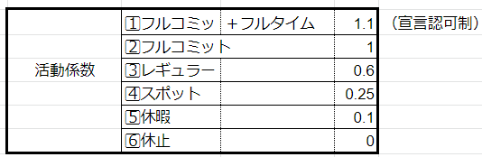

# クラスと活動係数

クラスは、「トレーニー」「ジュニア」「ミドル」「シニア」「プリンシパル」が設定されている。

「トレーニー」：研修生　$500

「ジュニア」：セミソロ（タスク等の進行にサポートが必要）　$1500

「ジュニア」：ソロ（一人前）　$2500

「シニア」：ティーチングができる、又は行っている。　$3500

「プリンシパル」：リーディングができる、又は行っている。　$5000

活動係数は自主申告制となっており、

暫定ルール： \
１、当月最終日曜日～翌月第一日曜日までに特設されるスレッドにて、開発部と運営ｻﾎﾟｰﾄロールメンバーは各自"活動係数"を自己申請する。1⃣ 2⃣ 3⃣ 4⃣ 5⃣ 6⃣ のいずれかを選択し、それだけコメントでOK。 ２、第三者は誰もが○ 及び修正すべき提案を該当する番号でリアクションできる。 \
３、○ の数を上回る且つ修正提案得票が5件以上ある場合は、第二日曜日18時を期限として修正成立。\
４、対象者は修正案を受け入れるか、説明等を追加し「ルール１、」に戻って再合意の形成が可能。この場合は第三日曜日15時までに再審を決する。 \
５、活動係数以外の申請も自薦他薦問わず同様の方法で申請可能。（クラス、主スキル、従スキル等） ６、第一日曜日までに活動係数の自己申請が無い場合又は第三日曜日までに合意に至らない場合は、当月の報酬は無効となる。 \
７、活動係数の自己申請が二ヵ月間連続で行われない場合、当月末にてロールの撤去とします。（6⃣ の中長期休暇による休止中も二ヵ月毎の更新申請がある場合はその限りではない。）

活動係数の目安：\
1⃣ フルコミット＋フルタイムは、オンライン時間が長く常に何かしらの活動を目論み、自他ともにそれを認められる状態。 \
2⃣ フルコミットは、専属的に長時間の活動が見られ実績が同意される状態。 \
3⃣ レギュラーは、要所での活躍に不足が無い状態。 \
4⃣ スポットは、常にではないが必要に応じたタスク等やピンポイントの活動が見られる状態。 \
5⃣ 休暇は、ほぼ活動ができていないが潜在的に予備動作の状態。 \
6⃣ 休止は、離脱等が想定される。又は自主的な中長期の休暇など。

